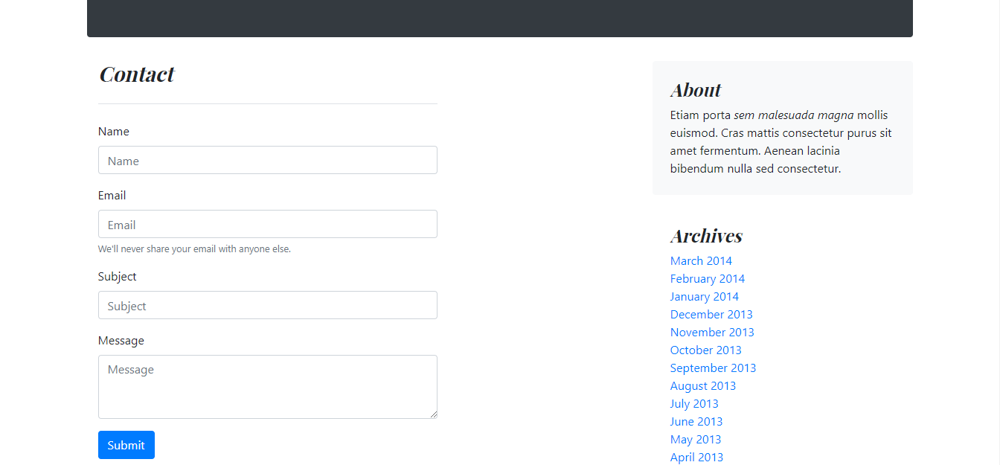

# blog_386

**blog_386** es una plantilla para microblog personal simple de usar, ligera, rápida y libre que está creado en El Reino de España.

**blog_386** se desarrolla con las siguientes fantasticas tecnologías:

* Ruby
* Sinatra
* SQLite
* BOOTSTRA.386
* jQuery

#### De la caja

* Blog
* Página de entrada
* Comentarios
* Formulario de contacto
* Verificación de formularios

#### Licensia

Eres libre y tienes derecho de hacer todo lo que quieres.

#### Pantallas

Blog ->

Formulario de entrada ->

Comentarios ->

Formulario de comentario ->

Formulario de contacto ->
