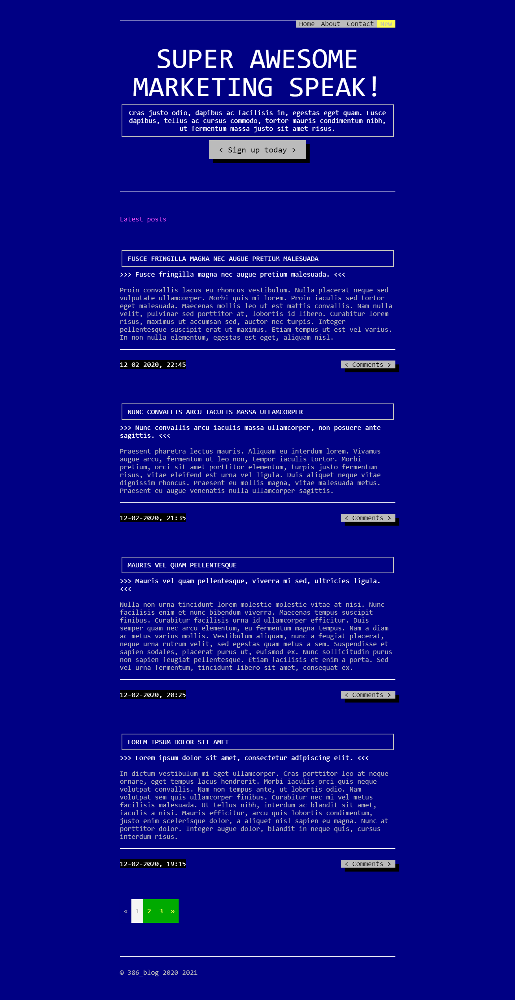
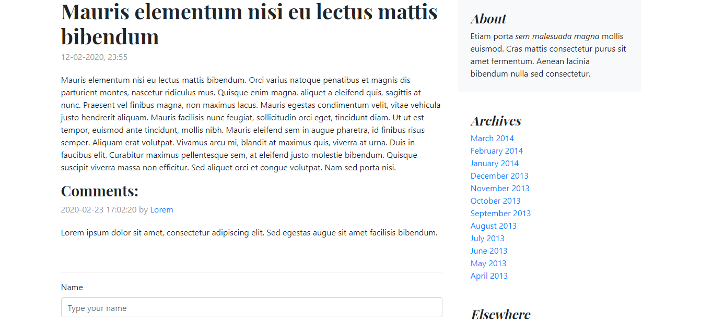
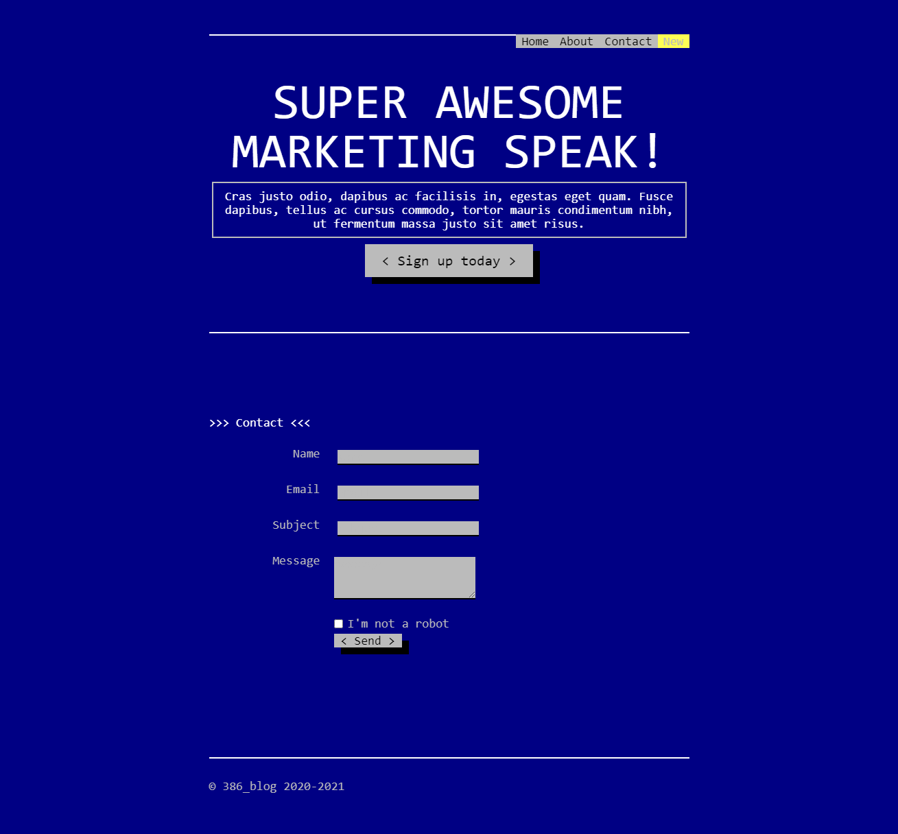

# blog_386

**blog_386** es una plantilla para blog personal simple de usar, ligera, rápida y libre que está creado en El Reino de España.

**blog_386** se desarrolla con las siguientes fantasticas tecnologías:

* Ruby
* Sinatra
* SQLite
* BOOTSTRA.386
* jQuery

## De la caja

* Blog
* Formulario de nueva entrada
* Comentarios
* Formulario de contacto
* Verificación de formularios del lado de cliente y del servidor

## Ejecutar:

*bundle*

*bundle exec ruby app.rb*

## Licensia

Eres libre y tienes derecho de hacer todo lo que quieres.

## Pantallas

Página de inicio:

Nueva entrada:

Comentarios:

Formulario de contacto:

